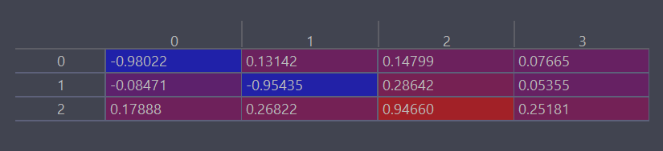
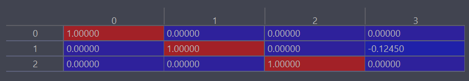
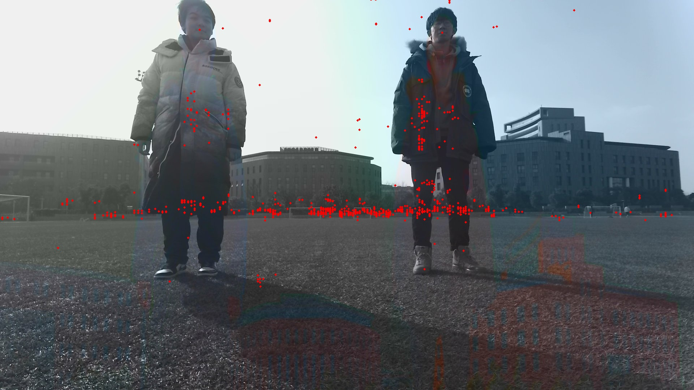

# mmw_radar_camera_calibration
## 摄像头毫米波雷达联合标定
整体思路：通过棋盘格标定法得到摄像头的内外参矩阵，再通过毫米波雷达与摄像头之间的坐标系关系得到他们之间的外参矩阵。
结合相机内参矩阵和毫米波雷达外参矩阵即可得到图片与毫米波雷达坐标转化关系。

### 摄像机标定
根据张标定法求出内参矩阵和外参矩阵。

##### 代码位置：
https://github.com/reidddddddd/mmw_radio_camera_calibration/blob/main/Calibration/calibration.py 里的calibration__camera方法，
其中输入参数model=0校准4k相机，model=1校准1080p相机。
 
##### 输入位置：
https://github.com/reidddddddd/mmw_radio_camera_calibration/tree/main/Calibration/images

##### 输出例子：

内参矩阵
 
 外参矩阵
 
 
我们主要将使用其中的内参矩阵作为相机的内部参数隐射相机坐标系和图像坐标系。
### 毫米波雷达标定

#### 方法1: 基于坐标系的转换
代码位置：https://github.com/reidddddddd/mmw_radio_camera_calibration/blob/main/Calibration/calibration.py 里的calibration_mmw_radar_camera方法  

在这个方法里，我们假定相机和雷达之间的坐标系不存在旋转关系，仅存在平移关系。我们通过测量相机和雷达之间的位置关系得到其转换矩阵。
毫米波外参矩阵.
 
 根据内外参矩阵，我们在室内进行了一些测试。结果如图所示。
  
  我们也在室外进行了一些测试。结果如图所示。
  

结论：根据结果图示，基本可以说明此方法有一定的合理性。但此方法在毫米波雷达标定部分主要基于测量，对结果的正确性缺乏解释力。期待以数据驱动型的标定方法予以评估标定的准确性。 
  
#### 方法2：基于点对于和最小二分法的标定方法
基本思路： 手动测量一批以雷达为坐标系的点，同时使用相机内外参得到这些点以相机为圆心的坐标值。根据这两批值采用最小二分法得到雷达外参矩阵  
进度: 目前只取了一个角度的数据。所以在构建外参矩阵时，存在overfiting的问题。具体而言，二分法在构建外参矩阵时，会修改外参矩阵中的旋转参数来达到结果的匹配。而实际情况是摄像头和雷达仅存在平移关系。
这是由于我们只采了一组数据导致的。但同时如果采集过多组数据，时间成本不可估计，同时不具有普适性。值得商榷。

